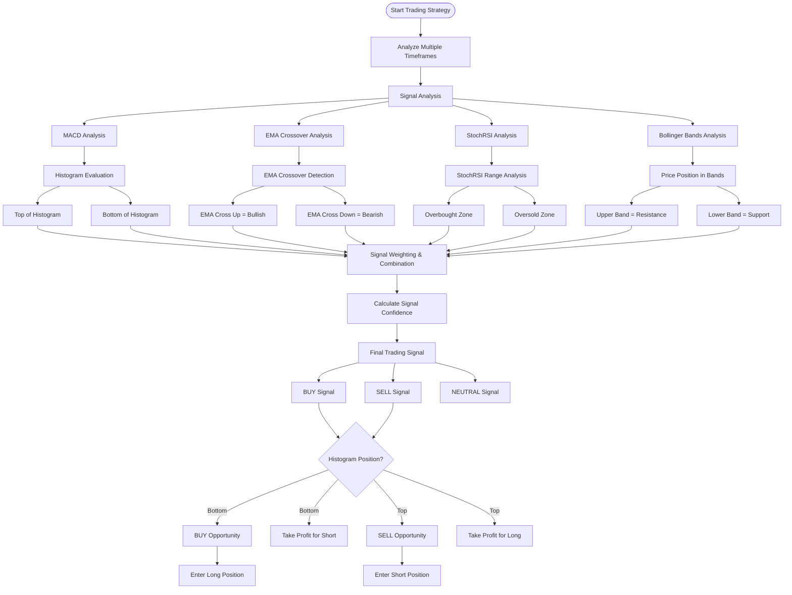

# Trading Strategy Flow Diagram

```mermaid
flowchart TD
    Start([Start Trading Strategy]) --> MultiTimeframe[Analyze Multiple Timeframes]
    MultiTimeframe --> SignalAnalysis[Signal Analysis]

    %% Core Signal Analysis
    SignalAnalysis --> MACD[MACD Analysis]
    SignalAnalysis --> EMA[EMA Crossover Analysis]
    SignalAnalysis --> StochRSI[StochRSI Analysis]
    SignalAnalysis --> BBands[Bollinger Bands Analysis]

    %% Signal Computation
    MACD --> HistogramEvaluation[Histogram Evaluation]
    HistogramEvaluation --> HistogramTop[Top of Histogram]
    HistogramEvaluation --> HistogramBottom[Bottom of Histogram]

    EMA --> EMACrossover[EMA Crossover Detection]
    EMACrossover --> EMACrossUp[EMA Cross Up = Bullish]
    EMACrossover --> EMACrossDown[EMA Cross Down = Bearish]

    StochRSI --> StochRSIRange[StochRSI Range Analysis]
    StochRSIRange --> OverBought[Overbought Zone]
    StochRSIRange --> OverSold[Oversold Zone]

    BBands --> PricePosition[Price Position in Bands]
    PricePosition --> UpperBand[Upper Band = Resistance]
    PricePosition --> LowerBand[Lower Band = Support]

    %% Signal Combination
    HistogramTop --> SignalWeighting[Signal Weighting & Combination]
    HistogramBottom --> SignalWeighting
    EMACrossUp --> SignalWeighting
    EMACrossDown --> SignalWeighting
    OverBought --> SignalWeighting
    OverSold --> SignalWeighting
    UpperBand --> SignalWeighting
    LowerBand --> SignalWeighting

    %% Final Signal
    SignalWeighting --> ConfidenceCalculation[Calculate Signal Confidence]
    ConfidenceCalculation --> FinalSignal[Final Trading Signal]
    FinalSignal --> BuySignal[BUY Signal]
    FinalSignal --> SellSignal[SELL Signal]
    FinalSignal --> NeutralSignal[NEUTRAL Signal]

    %% Trading Actions
    BuySignal --> HistogramPosition{Histogram Position?}
    SellSignal --> HistogramPosition

    %% Bottom Histogram Actions
    HistogramPosition -->|Bottom| BUY_OPPORTUNITY[BUY Opportunity]
    BUY_OPPORTUNITY --> EnterLong[Enter Long Position]
    HistogramPosition -->|Bottom| SELL_TP[Take Profit for Short]

    %% Top Histogram Actions
    HistogramPosition -->|Top| SELL_OPPORTUNITY[SELL Opportunity]
    SELL_OPPORTUNITY --> EnterShort[Enter Short Position]
    HistogramPosition -->|Top| BUY_TP[Take Profit for Long]
```
